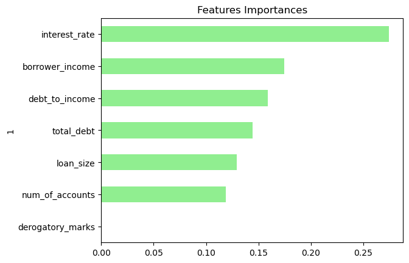

# Module 12 Report Template

## Overview of the Analysis

* The purpose of the analysis:
Using a dataset of historical lending activity from a peer-to-peer lending services company to build a model that can identify the creditworthiness of borrowers.

* Dataset:
The dataset contains historical lending activities of a peer-to-peer lending services company e.g. 	the loan size,	interest rate, borrower's income,	debt to income ratio,	num of accounts,	derogatory marks,	total debt and	loan status.

* The variable used for prediction:
In this instance I have used 'loan_status' as a variable to try and predict the creditworthiness of the borrower where "0" is 'healthy loan' and "1" is 'high-risk loan'.

* The stages of the Machine Learning process:

Data Preparation and Feature Selection: Ensuring the data is cleaned, preprocessed, and ready for analysis. Here I have split the data into (X) features (input = loan size,	interest rate, borrower's income,	debt to income ratio,	num of accounts,	derogatory marks,	total debt) and (y) the target variable (output = loan status).

Model Training: Split the dataset into a training set and a testing/validation set. Used the training set to train various regression and classification models on the selected features.

Model Evaluation: After training, used the testing/validation set to evaluate the performance of each model. Used Classification Reports, Accuracy Scores and Confusion Matrix. It provides valuable insights into different aspects of the model like accuracy, precision, recall, F1-score to assess how well a model is classifying loan statuses.

Precision: Precision measures the proportion of correctly predicted instances among the instances predicted as a particular class.
Recall: Recall, also known as sensitivity or true positive rate, measures the proportion of correctly predicted instances among the instances that actually belong to a particular class.
F1-Score: The F1-score is the harmonic mean of precision and recall. It provides a balanced measure that considers both false positives and false negatives.
Accuracy: Accuracy measures the proportion of correctly predicted instances out of all instances.

Prediction: Once a model is trained and evaluated, I have then used it to make predictions on new data.

* Models used during this excercise are as below:

**Logistic Regression:**

Logistic Regression is a commonly used classification algorithm that models the probability of a binary outcome in this case 'healthy loans' and 'high risk loans'. It works well for linearly separable data and provides interpretable results in terms of feature contributions. Based on the results, the Logistic Regression model achieved high accuracy and reasonably good precision, recall, and F1-score for both classes. 

**SVM (Support Vector Machine):**

SVM is a powerful algorithm that aims to find a hyperplane that best separates different classes in this case class 0 which is 'healthy loans' and class 1 which is 'high risk loans'. It's effective for both linearly separable and non-linearly separable data, thanks to the use of kernel functions. The SVM model achieved the highest accuracy among all the models, along with strong precision, recall, and F1-score for class "1".

**Decision Tree:**

Decision Trees create a tree-like model of decisions and their possible consequences. They're easy to understand and can capture non-linear relationships in data. The Decision Tree model achieved good accuracy, but its F1-score for class "1" (high risk loan) is slightly lower compared to other models. 

**Random Forest:**

Random Forest is an ensemble method that combines multiple decision trees to improve accuracy and control overfitting. It's effective for handling complex data and capturing non-linear relationships. The Random Forest model achieved high accuracy and reasonable precision, recall, and F1-score for both classes. Please see below the features of importance when we use this model:

**KNN (K-Nearest Neighbors):**

KNN is a simple instance-based classification algorithm that classifies instances based on the majority class of their k-nearest neighbors.
It's effective for local patterns and non-linear relationships. The KNN model achieved high accuracy and reasonable precision, recall, and F1-score for both classes. 

## Results

Logistic Regression Classification Report: 
               precision    recall  f1-score   support

           0       0.99      1.00      1.00     18719
           1       0.91      0.85      0.88       665

    accuracy                           0.99     19384
   macro avg       0.95      0.92      0.94     19384
weighted avg       0.99      0.99      0.99     19384

Logistic Regression Accuracy Score: 0.9918489475856377 

-----------------------------------------------------------

SVM Classification Report: 
               precision    recall  f1-score   support

           0       0.99      1.00      1.00     18665
           1       0.98      0.84      0.91       719

    accuracy                           0.99     19384
   macro avg       0.99      0.92      0.95     19384
weighted avg       0.99      0.99      0.99     19384

SVM Accuracy Score: 0.9936029715229054 

-----------------------------------------------------------

Decision Tree Classification Report: 
               precision    recall  f1-score   support

           0       0.99      1.00      0.99     18759
           1       0.85      0.84      0.85       625

    accuracy                           0.99     19384
   macro avg       0.92      0.92      0.92     19384
weighted avg       0.99      0.99      0.99     19384

Decision Tree Accuracy Score: 0.9901981015270326 

-----------------------------------------------------------

Random Forrest Classification Report: 
               precision    recall  f1-score   support

           0       0.99      1.00      1.00     18725
           1       0.90      0.85      0.87       659

    accuracy                           0.99     19384
   macro avg       0.95      0.92      0.94     19384
weighted avg       0.99      0.99      0.99     19384

Random Forrest Accuracy Score: 0.9917457697069748 

-----------------------------------------------------------

KNN Classification Report: 
               precision    recall  f1-score   support

           0       0.99      1.00      1.00     18703
           1       0.93      0.84      0.88       681

    accuracy                           0.99     19384
   macro avg       0.96      0.92      0.94     19384
weighted avg       0.99      0.99      0.99     19384

KNN Accuracy Score: 0.9921584812216261
-----------------------------------------------------------

## Summary

Based on the comparison of Classification Reports and Accuracy Scores of all models, it appears that the SVM model has the highest accuracy (0.9936) among all the models. In this instance precision and recall for class "1" are crucial since we are dealing with a high-risk scenario. The SVM model has a good balance between precision and recall for class "1," suggesting that it might be a good trade-off between correctly classifying high-risk loans and minimizing false positives.

Please see below further breakdown of the reasons why SVM model is the most suitable model for this data/case:

For class "0" (healthy loan):

Precision: 1.00

Recall: 0.99

F1-Score: 1.00

This indicates that the SVM model performs very well in predicting healthy loans. It has a high precision, meaning that when it predicts a loan as healthy, it is almost always correct. The recall is also high, indicating that the model captures a large proportion of actual healthy loans. The F1-Score of 1.00 suggests a perfect balance between precision and recall for this class.

For class "1" (high-risk loan):

Precision: 0.84

Recall: 0.98

F1-Score: 0.91

This suggests that the SVM model performs well in predicting high-risk loans, but not as perfectly as for healthy loans. The precision of 0.84 means that when it predicts a loan as high-risk, it's correct about 84% of the time. The recall of 0.98 indicates that the model captures a high proportion of actual high-risk loans. The F1-Score of 0.91 indicates a good balance between precision and recall for this class.

In summary, the model performs extremely well for both the "0" class (healthy loans) and the "1" class (high-risk loans). It has high precision and recall values for both classes, indicating that it accurately predicts instances for both labels. The F1-Scores further confirm the balanced performance of the model for both classes.

